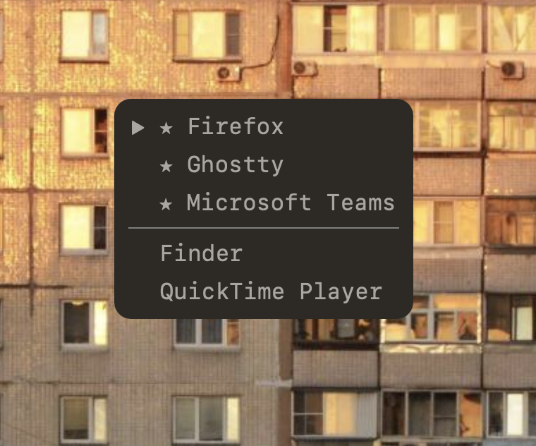

_%5F_/¯-brightgreen>)


# SeeWin

<div align="center">
  
</div>
<br>

**SeeWin** is a lightweight macOS utility for keyboard-based application switching. Inspired by the fact that I find `Cmd+Tab` annoying since it reorders everything by recency and I don't like having to visually look where the ~3 programs i use 90% of the time have been shuffled to this time.

---

## ✨ Features

- Minimal custom window switcher
- Highlighted selection and favorite apps
- Keybinding control for:

  - Navigation (up/down)
  - Quick app activation (using number keys 1-9 when the window is focused)
  - Marking favorites
  - Dynamic config reload

- Configurable Unicode/app indicator prefixes
- Global hotkey to toggle the switcher

---

## 🔧 Installation

```bash
sudo make install
```

This installs the binary to `/usr/local/bin/SeeWin` (or your chosen `$PREFIX`), allowing you to launch it from the terminal:

```bash
SeeWin
```

---

## ⚙️ Configuration

Place a `.seewinrc` file in your home directory:

```ini
prefix_selected=▶
prefix_unselected=
prefix_favorite=★
prefix_active=*

font_size=15

hotkey_modifier=cmd
hotkey_key=space

key_quit=q
key_favorite=f
key_up=j
key_down=k
key_activate=\r
key_reload=r
```

You can reload the config at runtime using the reload key (`r` above, for some changes they will only show up the next time the window becomes visible).

---

## 🛠 Build

```bash
make              # Build the binary in ./dist
make app          # Bundle with appify as macOS app (currently broken, might fix in the future)
sudo make install # Install to /usr/local/bin
make clean        # Clean build artifacts
```

---

## 📂 Project Structure

```
SeeWin/
├── src/            # All source files
│   ├── include/    # Header files
│   └── ...         # Core .c modules
├── dist/           # Build output
├── Makefile
├── appify          # Shell script to package app (broken)
└── README.md
```

---

## 🧪 Status

It's functional but still buggy. I am neither good at C nor at macOS development so beware if you look at the code and know what you're doing you might have a stroke.

I might work more on this in the future but for now it (mostly) does what I want so I'll leave it for now.

---

## 📄 License

GPL-3.0

---

## 🙌 Credits

Me (and ChatGPT who wrote me the objc macro variations because I'm too lazy to type them all out)
